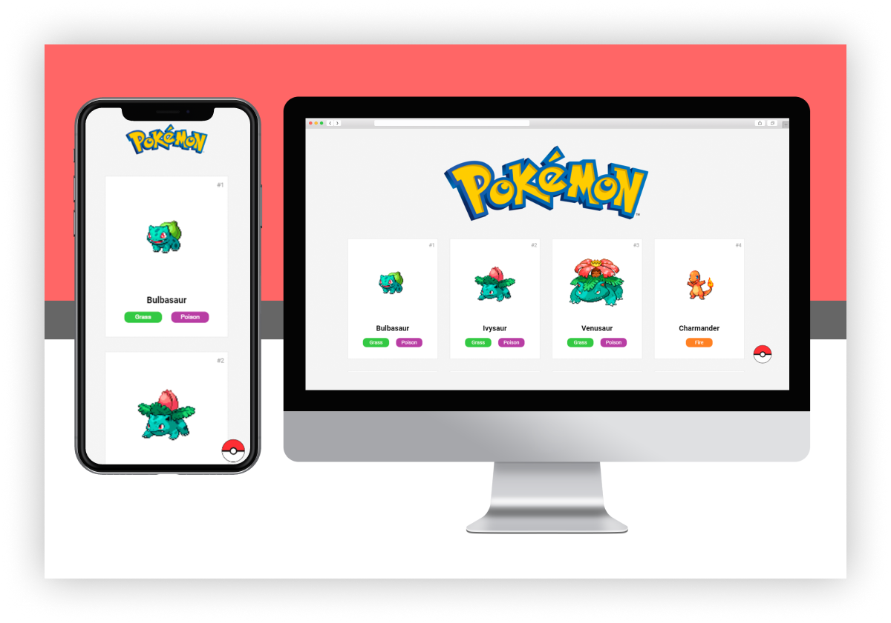

# PokéNode

  

Clique **[AQUI](https://pokenode.vercel.app/)** para **visualizar** o projeto.

## :fire: Projeto

O **PokéNode** é um projeto que tem como *finalidade* listar todos os pokémons da primeira geração (kanto).

## :rocket: Tecnologias

Esse projeto foi desenvolvido com as seguintes tecnologias:

- [Node.js](https://nodejs.org/en/)
- [Express](https://expressjs.com/pt-br/)
- Html, Css e Js

## :computer: Desenvolvimento

Foi utilizada a **[PokeApi](https://pokeapi.co/)** para a manipulação de dados do projeto.

1. Instale o Node 12+
2. Clone este repositório
3. No terminal, digite `npm install` para instalar as dependências (*express* e *nodemon*)
4. Depois, basta iniciar a aplicação com `npm run dev` 
5. Abra seu navegador e digite o seguinte endereço: `http://localhost:3000/`

##### Observações

- [Express](https://expressjs.com/pt-br/) como servidor de arquivos estáticos
- [Nodemon](https://nodemon.io/) para monitorar alterações nos arquivos e reiniciar automaticamente o servidor
- Requisições Http, status, fetch e promises
- Manipulação da DOM com js
- Flexbox css
- Hospedagem na [Vercel](https://vercel.com/)

##### A fazer

- [ ] Selecionar a geração a ser exibida
- [ ] Exibir pokémons ordenados pelo ID

## :keyboard: Layout

Você pode **baixar** o layout do projeto no formato `.fig` clicando **[AQUI](./assets/pokenode.fig)**.

Para abrir o arquivo no formato `.fig` em qualquer sistema operacional utilize a ferramenta [Figma](https://figma.com/).

## :pencil: ​Licença

Esse projeto está sob a licença MIT. 

Feito com :heart: by **[Juan Junger](https://www.linkedin.com/in/juan-junger/)** :happy:

